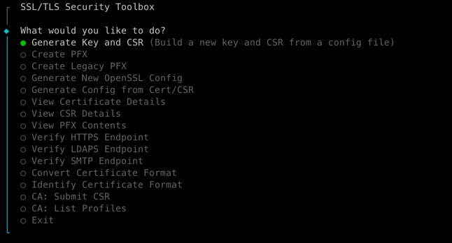

# ssl-toolbox

A cross-platform CLI for SSL/TLS certificate management. Generate keys and CSRs, build PFX files, verify TLS endpoints, convert between certificate formats, and optionally submit to Sectigo Certificate Manager -- all from a single binary with no runtime dependencies.

## Features

| Category | Capabilities |
|---|---|
| **Key & CSR** | Generate RSA 2048 private keys (AES-256-CBC encrypted) and CSRs with SANs (DNS, IP, email, URI) |
| **PFX/PKCS12** | Create modern (AES-256-SHA256) or legacy (TripleDES-SHA1) PFX files; convert between formats; inspect contents |
| **TLS Verification** | Probe HTTPS, LDAPS, and SMTP STARTTLS endpoints; report negotiated cipher, TLS version support (1.0-1.3), and validate hostname/expiry/chain |
| **Format Tools** | Convert between PEM, DER, and Base64; auto-detect certificate file formats |
| **Config Generation** | Build OpenSSL `.cnf` files interactively or extract them from existing certificates and CSRs |
| **CA Integration** | Submit CSRs to Sectigo SCM, list certificate profiles, and download signed certificates (feature-gated, optional) |

## Quick Start

```bash
# Build
cargo build --release

# Set up your organization defaults
./target/release/ssl-toolbox init
# Edit .ssl-toolbox/config.json with your org info

# Run the interactive menu
./target/release/ssl-toolbox

# Or use CLI commands directly
./target/release/ssl-toolbox new-config --out server.cnf
./target/release/ssl-toolbox generate --conf server.cnf --key server.key --csr server.csr
```

## Installation

### Build from Source

Requires Rust 1.85+ (edition 2024). OpenSSL is vendored -- no system OpenSSL needed.

```bash
cargo build --release -p ssl-toolbox
```

Binary: `target/release/ssl-toolbox`

Build without Sectigo CA support:

```bash
cargo build --release -p ssl-toolbox --no-default-features
```

### Pre-built Binaries

Download binaries from [GitHub Releases](../../releases/latest). Each release includes archives for:

- Linux x86_64 (`x86_64-unknown-linux-gnu`)
- Linux aarch64 (`aarch64-unknown-linux-gnu`)
- Windows x86_64 (`x86_64-pc-windows-msvc`)
- macOS x86_64 (`x86_64-apple-darwin`)
- macOS Apple Silicon (`aarch64-apple-darwin`)

A `sha256sums.txt` file is attached to every release for verification.

## Configuration

ssl-toolbox uses layered configuration. Values resolve in order (later wins):

1. Compiled defaults (empty strings)
2. `~/.ssl-toolbox/*.json` (user-level)
3. `./.ssl-toolbox/*.json` (project-level)
4. Environment variables / `.env`
5. CLI flags

Run `ssl-toolbox init` to generate template config files, or `ssl-toolbox init --global` for `~/.ssl-toolbox/`.

**`.ssl-toolbox/config.json`** -- CSR defaults used by interactive prompts:

```json
{
  "country": "US",
  "state": "Texas",
  "locality": "Dallas",
  "organization": "Acme Corp",
  "org_unit": "Engineering",
  "email": "certs@acme.com"
}
```

**`.ssl-toolbox/sectigo.json`** -- Sectigo plugin settings (only for CA features):

```json
{
  "api_base": "https://cert-manager.com",
  "org_id": "12345",
  "product_code": "4491",
  "token_url": "https://auth.sso.sectigo.com/auth/realms/apiclients/protocol/openid-connect/token"
}
```

Sectigo OAuth secrets go in `.env` (never in JSON):

```env
SCM_CLIENT_ID=<your client id>
SCM_CLIENT_SECRET=<your client secret>
```

## Command Reference



| Command | Description |
|---|---|
| *(no args)* | Launch interactive menu |
| `init [--global]` | Generate template config files |
| `generate --conf FILE --key FILE --csr FILE [--password PASS]` | Generate RSA key and CSR |
| `new-config [--out FILE]` | Build OpenSSL config interactively |
| `config --input FILE --out FILE [--is-csr]` | Extract config from cert or CSR |
| `pfx --key FILE --cert FILE --out FILE [--chain FILE] [--legacy]` | Create PFX file |
| `pfx-legacy --input FILE --out FILE` | Convert PFX to legacy TripleDES-SHA1 |
| `view-cert --input FILE` | Display certificate details |
| `view-csr --input FILE` | Display CSR details |
| `view-pfx --input FILE` | Display PFX contents |
| `verify-https --host HOST [--port PORT] [--no-verify]` | Check HTTPS endpoint |
| `verify-ldaps --host HOST [--port PORT] [--no-verify]` | Check LDAPS endpoint |
| `verify-smtp --host HOST [--port PORT] [--no-verify]` | Check SMTP STARTTLS endpoint |
| `convert --input FILE --output FILE --format FORMAT` | Convert cert format (pem/der/base64) |
| `identify --input FILE` | Auto-detect certificate format |
| `ca list-profiles` | List available Sectigo cert types |
| `ca submit --csr FILE --out FILE [--description TEXT] [--product-code CODE]` | Submit CSR to Sectigo |
| `ca collect --id ID --out FILE [--format FORMAT]` | Download signed cert (pem/chain/pkcs7) |

All commands accept the global `--debug` flag for verbose output.

For detailed usage of every command, see [docs/USER_MANUAL.md](docs/USER_MANUAL.md).

## Architecture

```
ssl-toolbox (workspace)
  crates/
    ssl-toolbox/           CLI binary: clap commands, interactive menu, display
    ssl-toolbox-core/      Library: key/CSR gen, PFX, TLS, SMTP, validation, convert, config
    ssl-toolbox-ca/        CA plugin trait (CaPlugin, CertProfile, SubmitOptions)
    ssl-toolbox-ca-sectigo/ Sectigo SCM implementation (feature-gated)
```

The `sectigo` feature is on by default. Disable it with `--no-default-features` for a standalone tool with no CA dependencies.

## Development

```bash
cargo check --workspace                          # type-check all crates
cargo check -p ssl-toolbox --no-default-features # verify sans-Sectigo build
cargo test --workspace                           # run tests
cargo build --release -p ssl-toolbox             # release binary
```

This repo includes a `.githooks/pre-push` hook that runs `cargo clippy --workspace -- -D warnings`.
Enable it locally with `git config core.hooksPath .githooks`.

## License

MIT OR Apache-2.0
