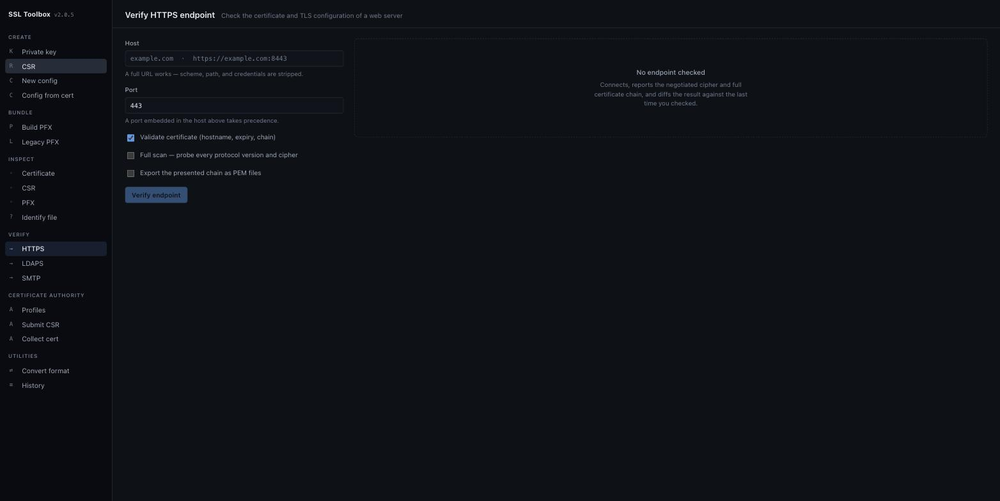

# ssl-toolbox

Cross-platform SSL/TLS certificate management. Generate keys and CSRs, build PFX files, verify TLS endpoints, convert between certificate formats, and optionally submit to Sectigo Certificate Manager.

Ships as two front-ends over one shared engine:

- **`ssl-toolbox`** — the CLI. A single statically-linked binary with no runtime dependencies; the right choice for servers, jump hosts, and scripting.
- **SSL Toolbox** — the desktop app (Tauri). The same capabilities with a UI. Uses the host's system webview, so unlike the CLI it is **not** dependency-free — see [Installation](#installation).

Both drive the same `ssl-toolbox-ops` engine, so neither can do something the other cannot.



## Features

| Category | Capabilities |
|---|---|
| **Key & CSR** | Generate RSA 2048 private keys (AES-256-CBC encrypted) and CSRs with SANs (DNS, IP, email, URI) |
| **PFX/PKCS12** | Create modern (AES-256-SHA256) or legacy (TripleDES-SHA1) PFX files; convert between formats; inspect contents |
| **Certificate Search** | Find issued certificates by common name, SAN, serial, or status; the result's ID feeds straight into collection |
| **Certificate Retrieval** | Collect issued certificates in all seven formats the CA offers — certificate only, with issuer after, with chain, PKCS#7 (DER or PEM), intermediates/root, root/intermediates |
| **TLS Verification** | Probe HTTPS, LDAPS, SMTP STARTTLS, and SQL Server endpoints; report negotiated cipher, TLS version support where the transport permits it, validate hostname/expiry/chain, and optionally run a full protocol/cipher-suite scan across the locally testable cipher set for HTTPS and LDAPS |
| **Format Tools** | Convert between PEM, DER, and Base64; auto-detect certificate file formats |
| **Config Generation** | Build OpenSSL `.cnf` files interactively or extract them from existing certificates and CSRs |
| **Workflow** | Persistent workspace state tracks your active profile, artifacts, and recent jobs across sessions |
| **CA Integration** | Submit CSRs to Sectigo SCM, list certificate profiles, and download signed certificates (feature-gated, optional) |
| **Credentials** | CA client credentials in an encrypted local vault (scrypt + AES-256-GCM), configurable from the desktop UI or the CLI; environment variables still override for CI |

## Quick Start

```bash
# Build
cargo build --release

# Set up your organization defaults
./target/release/ssl-toolbox init
# Edit .ssl-toolbox/config.json with your org info

# Show the available commands
./target/release/ssl-toolbox --help

# Run commands directly
./target/release/ssl-toolbox new-config --out server.cnf
./target/release/ssl-toolbox key --key server.key
./target/release/ssl-toolbox generate --conf server.cnf --key server.key --csr server.csr
```

## Installation

### CLI — build from source

Requires Rust 1.85+ (edition 2024). OpenSSL is vendored -- no system OpenSSL needed.

```bash
cargo build --release -p ssl-toolbox
```

Binary: `target/release/ssl-toolbox`

Build without Sectigo CA support:

```bash
cargo build --release -p ssl-toolbox --no-default-features
```

### CLI — pre-built binaries

Download binaries from [GitHub Releases](../../releases/latest). Each release includes archives for:

- Linux x86_64 (`x86_64-unknown-linux-gnu`)
- Linux aarch64 (`aarch64-unknown-linux-gnu`)
- Windows x86_64 (`x86_64-pc-windows-msvc`)
- macOS x86_64 (`x86_64-apple-darwin`)
- macOS Apple Silicon (`aarch64-apple-darwin`)

A `sha256sums.txt` file is attached to every release for verification.

### Desktop app — build from source

Additionally requires Node.js 18+ and the Tauri CLI (`cargo install tauri-cli --version '^2'`).

```bash
cd crates/ssl-toolbox-gui
npm --prefix ui install
cargo tauri build     # or: cargo tauri dev
```

**Runtime dependencies.** The desktop app renders in the operating system's webview rather than bundling a browser engine. That keeps the download small but means it is not self-contained the way the CLI is:

| Platform | Requirement |
|---|---|
| macOS | WKWebView — present on every supported macOS |
| Windows | WebView2 runtime — preinstalled on Windows 11; the installer bootstraps it on Windows 10 |
| Linux | `webkit2gtk-4.1` — must be installed from the distro's package manager |

For servers, containers, jump hosts, and anywhere you cannot guarantee a webview, use the CLI.

## Configuration

ssl-toolbox uses layered configuration. Values resolve in order (later wins):

1. Compiled defaults (empty strings)
2. `~/.ssl-toolbox/*.json` (user-level)
3. `./.ssl-toolbox/*.json` (project-level)
4. `~/.ssl-toolbox/credentials.vault` (CA credentials only, encrypted)
5. Environment variables / `.env`
6. CLI flags

Run `ssl-toolbox init` to generate template config files, or `ssl-toolbox init --global` for `~/.ssl-toolbox/`.

**`.ssl-toolbox/config.json`** -- CSR defaults used by interactive prompts:

```json
{
  "country": "US",
  "state": "Texas",
  "locality": "Dallas",
  "organization": "Acme Corp",
  "org_unit": "Engineering",
  "email": "certs@acme.com"
}
```

**`.ssl-toolbox/sectigo.json`** -- Sectigo plugin settings (only for CA features):

```json
{
  "api_base": "https://admin.enterprise.sectigo.com",
  "org_id": "12345",
  "product_code": "4491",
  "token_url": "https://auth.sso.sectigo.com/auth/realms/apiclients/protocol/openid-connect/token"
}
```

### CA credentials

Client credentials are never stored in JSON. They live in an encrypted vault at
`~/.ssl-toolbox/credentials.vault`, which both the CLI and the desktop app read.

In the desktop app: **Certificate Authority → Settings**.

From the CLI:

```bash
ssl-toolbox ca login          # prompts for client ID, secret, and a vault passphrase
ssl-toolbox ca settings       # show configuration and where credentials resolve from
ssl-toolbox ca test-connection
ssl-toolbox ca logout         # delete the vault
```

The vault is sealed with scrypt + AES-256-GCM under a passphrase you choose. That
passphrase is the only key — **there is no recovery if you lose it**; reissue the
credentials at the CA and run `ca login` again. It is prompted for once per CLI
invocation and once per desktop app launch.

Endpoint settings can also be set without the UI:

```bash
ssl-toolbox ca configure --org-id 12345 --token-url https://auth.example.com/.../token
```

**Environment variables still win.** For CI, containers, and jump hosts, export both
and the vault is bypassed entirely:

```env
SCM_CLIENT_ID=<your client id>
SCM_CLIENT_SECRET=<your client secret>
```

Setting only one of the two is an error rather than a silent fallback to the vault —
a half-configured override would otherwise authenticate as a different account than
you intended.

## Command Reference

| Command | Description |
|---|---|
| *(no args)* | Print help; a subcommand is required |
| `init [--global]` | Generate template config files |
| `key --key FILE [--password PASS]` | Generate an encrypted RSA private key |
| `generate --conf FILE --key FILE --csr FILE [--password PASS]` | Generate a CSR with an existing key, or create the key first if needed |
| `new-config [--out FILE]` | Build OpenSSL config interactively |
| `config --input FILE --out FILE [--is-csr]` | Extract config from cert or CSR |
| `pfx --key FILE --cert FILE --out FILE [--chain FILE] [--legacy]` | Create PFX file |
| `pfx-legacy --input FILE --out FILE` | Convert PFX to legacy TripleDES-SHA1 |
| `view-cert --input FILE [--out FILE]` | Display certificate details |
| `view-csr --input FILE [--out FILE]` | Display CSR details |
| `view-pfx --input FILE [--out FILE]` | Display PFX contents |
| `verify-https --host HOST [--port PORT] [--no-verify] [--full-scan] [--out FILE] [--export-certs DIR]` | Check HTTPS endpoint |
| `verify-ldaps --host HOST [--port PORT] [--no-verify] [--full-scan] [--ldap-config-test] [--ldap-port PORT] [--ldap-bind-dn DN] [--ldap-bind-password PASS] [--out FILE] [--export-certs DIR]` | Check LDAPS endpoint |
| `verify-smtp --host HOST [--port PORT] [--no-verify] [--out FILE]` | Check SMTP STARTTLS endpoint |
| `verify-sql-server --host HOST [--port PORT] [--no-verify] [--out FILE] [--export-certs DIR]` | Check SQL Server endpoint over TDS encryption negotiation |
| `convert --input FILE --output FILE --format FORMAT` | Convert cert format (pem/der/base64) |
| `identify --input FILE [--out FILE]` | Auto-detect certificate format |
| `ca settings [--out FILE]` | Show CA configuration and where credentials resolve from |
| `ca configure [--api-base URL] [--org-id ID] [--product-code CODE] [--token-url URL]` | Write CA endpoint settings |
| `ca login [--client-id ID]` | Store client credentials in the encrypted vault (prompts for the secret) |
| `ca logout` | Delete the credential vault |
| `ca test-connection` | Authenticate against the CA without performing an operation |
| `ca list-profiles [--out FILE]` | List available Sectigo cert types |
| `ca search [--common-name NAME] [--san NAME] [--serial HEX] [--status STATUS] [--profile-id ID] [--size N] [--position N] [--no-dates] [--out FILE]` | Find issued certificates |
| `ca show --id ID [--out FILE]` | Show the full record for one certificate |
| `ca requests [--out FILE]` | List CSRs submitted from this workspace |
| `ca submit --csr FILE [--out FILE] [--description TEXT] [--product-code CODE] [--term-days N]` | Submit CSR to Sectigo |
| `ca collect --id ID --out FILE [--format FORMAT]` | Download signed cert (pem/chain/pkcs7) |

All commands accept the global `--debug` flag for verbose output.

For detailed usage of every command, see [docs/USER_MANUAL.md](docs/USER_MANUAL.md).

## Architecture

ssl-toolbox is a Cargo workspace of six crates. Two front-ends sit on one headless engine:

```
ssl-toolbox (workspace)
  crates/
    ssl-toolbox/            CLI front-end: clap commands, terminal rendering
    ssl-toolbox-gui/        Desktop front-end: Tauri v2 commands + React/TS UI
    ssl-toolbox-ops/        Headless engine: OpRequest/OpOutcome, workflow memory, audit
    ssl-toolbox-core/       Library: key/CSR gen, PFX, TLS, SMTP, validation, convert, config
    ssl-toolbox-ca/         CA plugin trait (CaPlugin, CertProfile, SubmitOptions)
    ssl-toolbox-ca-sectigo/ Sectigo SCM implementation (feature-gated)
```

[ARCHITECTURE.md](ARCHITECTURE.md) is the authoritative technical spec for all design and behavioral details -- crate boundaries, configuration model, TLS/PFX contracts, the CA plugin trait, and the threat model. The `sectigo` feature is on by default; disable it with `--no-default-features` for a standalone build with no CA dependencies.

## Development

```bash
cargo check --workspace                          # type-check all crates
cargo check -p ssl-toolbox --no-default-features # verify sans-Sectigo build
cargo test --workspace                           # run tests
cargo build --release -p ssl-toolbox             # release binary
```

This repo includes a `.githooks/pre-push` hook that runs `cargo clippy --workspace -- -D warnings`.
Enable it locally with `git config core.hooksPath .githooks`.

## Documentation Flow

```
ARCHITECTURE.md (spec) -> Tests (encode spec) -> Code (satisfies tests)
```

[ARCHITECTURE.md](ARCHITECTURE.md) is the authoritative technical schematic -- the single source of truth for how ssl-toolbox works. Every feature and behavioral change must be documented there **before or alongside** the code change. Tests are written against ARCHITECTURE.md, and code is written to pass the tests.

> **If it's not in ARCHITECTURE.md, it doesn't have a spec. If it doesn't have a spec, it can't have tests. If it can't have tests, it doesn't ship.**

## Contributing

See [CONTRIBUTING.md](CONTRIBUTING.md) for the TDD workflow, issue requirements, PR gates, and CHANGELOG format.

## License

MIT OR Apache-2.0

## See Also

- [ARCHITECTURE.md](ARCHITECTURE.md) -- authoritative technical spec (crates, config, TLS, PFX, CA plugins, threat model)
- [CONTRIBUTING.md](CONTRIBUTING.md) -- TDD workflow, PR requirements, CHANGELOG format
- [CHANGELOG.md](CHANGELOG.md) -- release history and notable changes
- [docs/USER_MANUAL.md](docs/USER_MANUAL.md) -- detailed command-by-command usage guide

## Saving output

Every command that renders a report accepts `--out FILE`, writing exactly what
it printed:

```bash
ssl-toolbox verify-https --host example.com --out https-report.txt
ssl-toolbox view-cert --input server.crt --out cert-details.txt
ssl-toolbox ca settings --out ca-config.txt
```

## Collecting a signed certificate

`--format` mirrors the CA console's Retrieve menu:

| Token | Artifact |
|---|---|
| `cert` | Certificate only, PEM encoded |
| `cert-issuer-after` | Certificate (w/ issuer after), PEM encoded |
| `chain` | Certificate (w/ chain), PEM encoded — the default, and what most servers want |
| `pkcs7` | PKCS#7, DER encoded |
| `pkcs7-pem` | PKCS#7, PEM encoded |
| `intermediates` | Intermediate(s)/Root only, PEM encoded |
| `root-first` | Root/Intermediate(s) only, PEM encoded |

Request IDs from previous submissions are remembered per workspace:

```bash
ssl-toolbox ca requests
ssl-toolbox ca collect --id 1234567 --out server.pem --format chain
```
